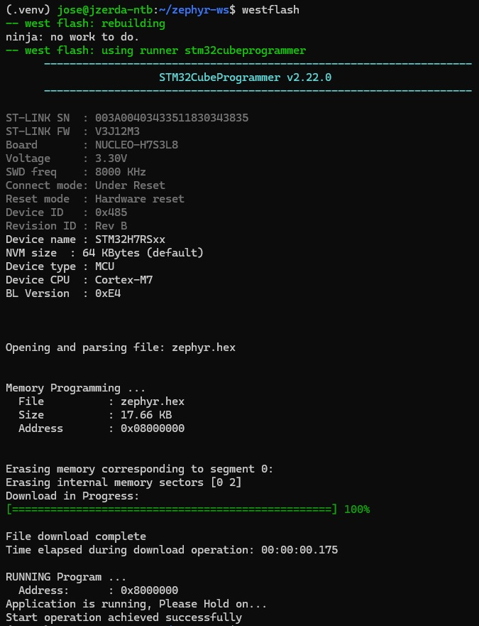
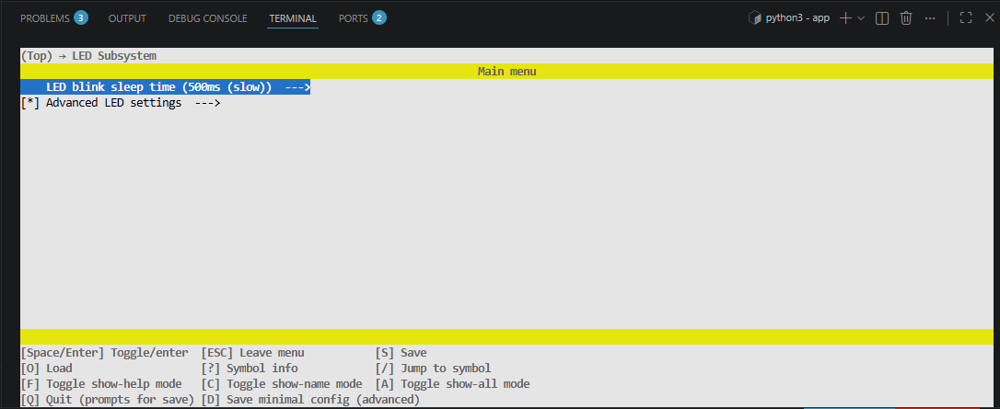

Welcome to the Zephyr RTOS training! This repository includes a ready-to-use
development environment based on Zephyr 4.3.0, which you can set up in one of
three ways:

---

## Manual Zephyr Setup

Follow the following guide:
- [Getting Started Guide](https://docs.zephyrproject.org/latest/develop/getting_started/index.html#).

Make sure to select appropriate OS and to perform all steps till
[Build the Blinky Sample](https://docs.zephyrproject.org/latest/develop/getting_started/index.html#build-the-blinky-sample).

---

## Clone and Build This Project
### l2-task1

Execute:

```bash
git clone https://github.com/josezerda/zephyr-course.git
cd zephyr-course
source ~/zephyrproject/.venv/bin/activate
west init
west update
west build -p always -b nucleo_h7s3l8 ~/zephyrproject/zephyr/samples/basic/blinky
west flash
```
### l3-task1
Execute:

```bash
cd app
west build -b nucleo_h7s3l8/stm32h7s3xx/ext_flash_app
west build -t menuconfig
```  







