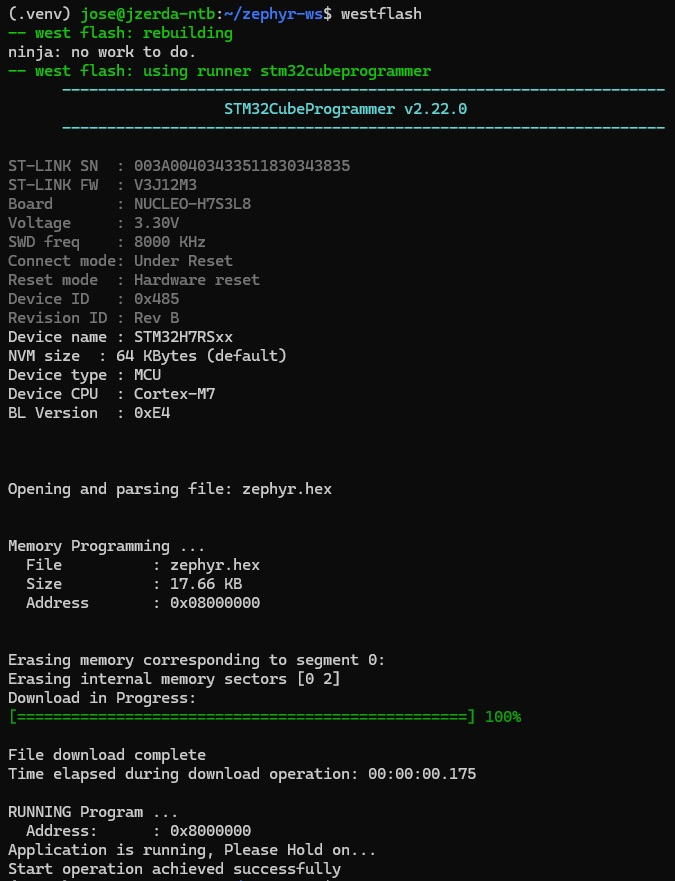
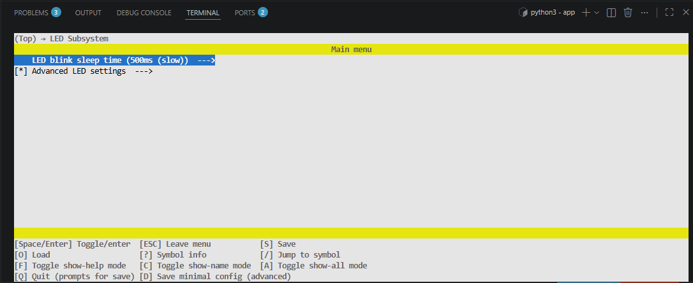

Welcome to the Zephyr RTOS training! This repository includes a ready-to-use
development environment based on Zephyr 4.3.0, which you can set up in one of
three ways:

---

## Manual Zephyr Setup

Follow the following guide:
- [Getting Started Guide](https://docs.zephyrproject.org/latest/develop/getting_started/index.html#).

Make sure to select appropriate OS and to perform all steps till
[Build the Blinky Sample](https://docs.zephyrproject.org/latest/develop/getting_started/index.html#build-the-blinky-sample).

---

## Clone and Build This Project

### l2-task1

Execute:

```bash
git clone https://github.com/josezerda/zephyr-course.git
cd zephyr-course
source ~/zephyrproject/.venv/bin/activate
west init
west update
west build -p always -b nucleo_h7s3l8 ~/zephyrproject/zephyr/samples/basic/blinky
west flash
```

### l3-task1

Execute:

```bash
cd app
west build -b nucleo_h7s3l8/stm32h7s3xx/ext_flash_app
west build -t menuconfig
```





---

### l5-task2: Custom Board From Scratch

Board structure for `my_scratch_board`:

| File | Purpose |
|---|---|
| `board.yml` | Board metadata (name, SoC) |
| `Kconfig.my_scratch_board` | Selects `SOC_STM32H7S3XX` |
| `Kconfig.defconfig` | Board-level Kconfig defaults |
| `my_scratch_board.dts` | Minimal DTS: clocks, USART3, flash, RAM |
| `my_scratch_board_defconfig` | Enables UART, console, GPIO |
| `board.cmake` | STM32CubeProgrammer flash runner |
| `CMakeLists.txt` | Compiles `board_init.c` |
| `board_init.c` | `SYS_INIT` prints "Board Initialized" before `main()` |

---

### l6-task1: Sensor Driver for On-Board LED

New module: `drivers/` — registered as a Zephyr extra module via `ZEPHYR_EXTRA_MODULES` in `app/CMakeLists.txt`.

| File | Purpose |
|---|---|
| `drivers/zephyr/module.yml` | Registers the module's cmake, Kconfig, and DTS root |
| `drivers/CMakeLists.txt` | Conditionally adds `sensor/` subdirectory |
| `drivers/Kconfig` | Sources `sensor/Kconfig` |
| `drivers/sensor/led_sensor/led_sensor.c` | Driver: `sample_fetch` → LED on, `channel_get` → LED off |
| `drivers/sensor/led_sensor/Kconfig` | `LED_SENSOR` symbol, `default y`, select `SENSOR` |
| `drivers/dts/bindings/sensor/custom,led-sensor.yaml` | DT binding defining the `gpios` phandle-array property |
| `drivers/dts/bindings/vendor-prefixes.txt` | Registers the `custom` vendor prefix |

Modified app files:

- `app/CMakeLists.txt` — adds `ZEPHYR_EXTRA_MODULES`
- `app/app.overlay` — adds `led_sensor: led-sensor` node on PD10
- `app/prj.conf` — adds `CONFIG_SENSOR=y`, `CONFIG_LED_SENSOR=y`
- `app/src/main.cpp` — uses `sensor_sample_fetch` / `sensor_channel_get` to blink the LED

> **Key gotcha:** `module.yml` must use `build.settings.dts_root: .` (not `dts.bindings`) for Zephyr to include the module's `dts/bindings/` in the DTS compilation path.

---

### l6-task2: Custom Extension API

**Driver changes** (`led_sensor.c`, `led_sensor.h`):

- `struct led_sensor_data` now has a `blink_count` field (the dynamic data parameter)
- `struct led_sensor_driver_api` extends `sensor_driver_api` by appending a `set_blink_count` function pointer — `sensor_driver_api` is the first member so the sensor subsystem can safely cast `dev->api` to the standard type
- `sample_fetch` increments `blink_count`; `channel_get` returns it in `val.val1`
- `led_sensor_set_blink_count()` is an inline public helper in the header that casts `dev->api` and calls the function pointer

**App** (`main.cpp`): calls `led_sensor_set_blink_count(dev, 0)` at startup to reset the counter, then logs the running count each blink via `val.val1` from `channel_get`.

---

### l7-task1: Sensor Shell Commands

Added a `sensor` root shell command with three subcommands (`app/src/sensor_shell.c`):

| Command | What it proves |
|---|---|
| `sensor info` | Driver is initialised and `device_is_ready()` returns true |
| `sensor fetch` | `sensor_sample_fetch` is wired through the API to `gpio_pin_set(..., 1)` — LED visibly turns on |
| `sensor read` | `sensor_channel_get` turns LED off and returns `blink_count` from the dynamic data struct — proving the data struct is live and accumulating state |

---

### l7-task2: Extension API as Shell Subcommand

Added `sensor set <value>` to `app/src/sensor_shell.c` using `SHELL_CMD_ARG`:

- `SHELL_CMD_ARG(set, ..., 2, 0)` enforces argument count — the shell framework rejects the command before the handler runs if the value is missing
- Handler validates content with `shell_strtoul` (catches non-numeric input) and range-checks against `BLINK_COUNT_MAX` (100000), printing `shell_error` on failure
- On success calls `led_sensor_set_blink_count()` from the L06 Task 2 extension API to update `blink_count` in the driver's dynamic data struct

| Input | Validation layer | Result |
|---|---|---|
| `sensor set` | `SHELL_CMD_ARG` (count) | `wrong parameter count` |
| `sensor set abc` | `shell_strtoul` (type) | `error: invalid value 'abc'` |
| `sensor set 999999` | range check (value) | `error: value out of range — must be 0..100000` |
| `sensor set 42` | passes all checks | `blink_count set to 42` |

---

### l8-task1: Ring Buffer Unit Tests

**New files:**

```
app/modules/ring_buf/
├── include/ring_buf.h     — public API (rb_ prefix to avoid Zephyr's ring_buf_* clash)
└── src/ring_buf.c         — circular FIFO implementation

tests/ring_buf/
├── testcase.yaml          — twister suite discovery
├── prj.conf               — CONFIG_ZTEST=y, CONFIG_ZTEST_SHUFFLE=y
├── CMakeLists.txt         — links test file + ring_buf.c, adds include path
└── src/test_ring_buf.c    — 1 provided + 7 implemented tests
```

**The 7 implemented tests:**

| Suite | Test | What it verifies |
|---|---|---|
| `ring_buf_init` | `test_reinit_clears_state` | `rb_init()` after a push resets count to 0 |
| `ring_buf_push_pop` | `test_single_push_pop` | push 42 → pop returns 42, buffer empty |
| `ring_buf_push_pop` | `test_fifo_order` | push 1,2,3 → pop returns 1,2,3 in order |
| `ring_buf_push_pop` | `test_push_full_returns_enospc` | 5th push on capacity-4 buffer → `-ENOSPC` |
| `ring_buf_boundaries` | `test_peek_does_not_consume` | two peeks both return same value, count stays 1 |
| `ring_buf_boundaries` | `test_pop_null_returns_einval` | `rb_pop(NULL)` → `-EINVAL` |
| `ring_buf_boundaries` | `test_is_full_after_fill` | 4 pushes → `rb_is_full()` true, `rb_count()` == 4 |

**Result:** 8/8 passed on `native_sim` — `west twister -T tests/ring_buf -p native_sim`

---

### l8-task2: Coverage Report

Run with:

```bash
west twister -T tests/ring_buf -p native_sim \
    --coverage --coverage-tool gcovr \
    --coverage-basedir app/modules/ring_buf
```

**Coverage results for `ring_buf.c`:**

| Metric | Result | Threshold | Status |
|---|---|---|---|
| Lines | **88.2%** (30/34) | ≥ 81% | PASS |
| Functions | **100.0%** (7/7) | 100% | PASS |
| Branches | **64.3%** (9/14) | ≥ 64% | PASS |

The uncovered lines are the `LOG_ERR` / `LOG_WRN` paths inside `rb_init` (invalid capacity guard) — unreachable by the current tests because `before()` always calls `rb_init(4)`. All 7 public functions are fully exercised.

HTML report: `twister-out/coverage/index.html`